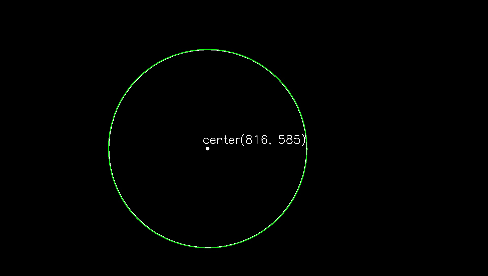
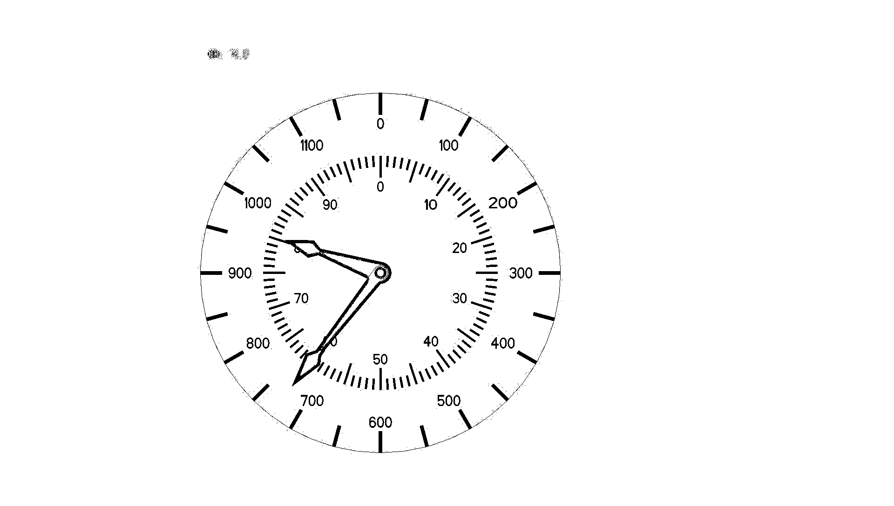
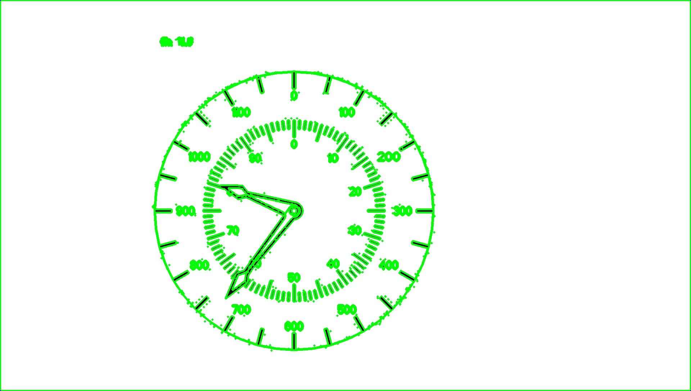
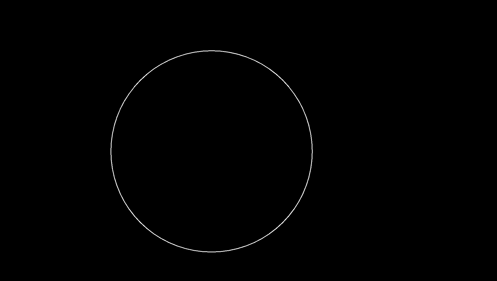
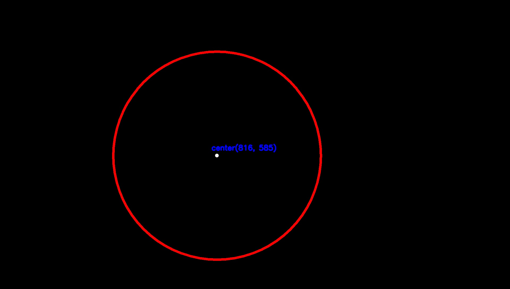
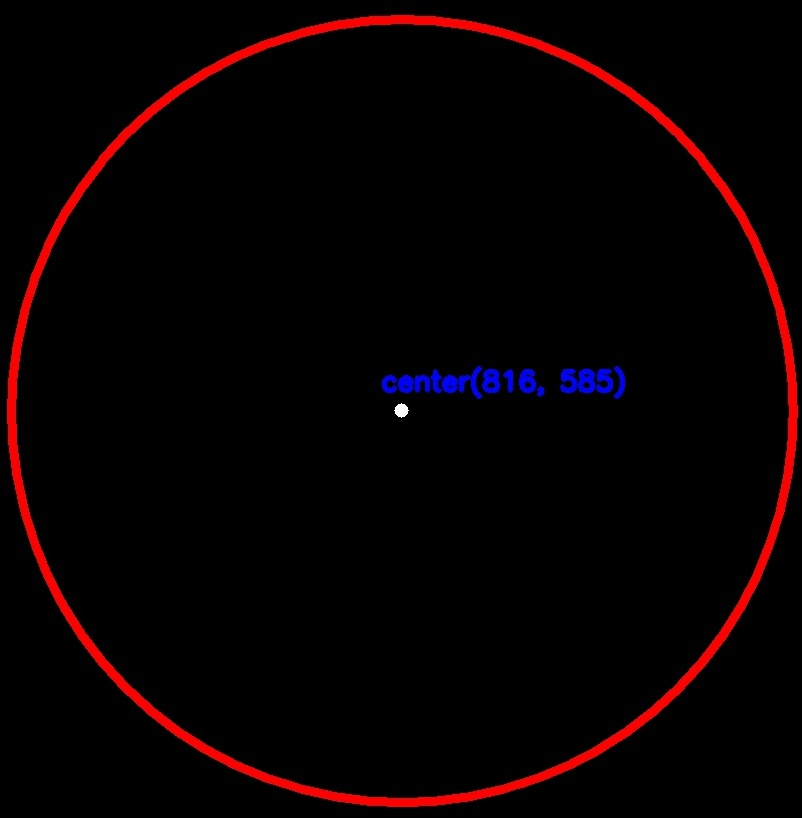

# dash_board
get center of shape of dash board

## Position the center of the dash board

- My src image

  
  

- binary results

  
  

- lunkuo results

  
  

- get circle results

  
  

- get center of circle results

  
  

  
  

# croped results

  
  
  

# Usage
- create center_result folder at your root path
- replace image path
- Run BCC.py
